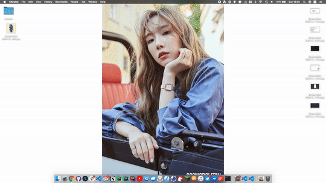

# iTerm2

## Dedicated Hotkey Windows

어디서나 간편하게 터미널을 꺼내기

### 설정 방법

1. **Preferences &gt; Keys &gt; Create a Dedicated Hotkey Window**
2. 설정하면 Hotkey Windows라는 프로파일이 생긴다.
3. **Preferences &gt; Profiles &gt; Hotkey Window &gt; Keys &gt; Configure Hotkey Window** 에서 단축키 설정
4. **Preferences &gt; Profiles &gt; Hotkey Window &gt; Window &gt; Style** 을 **Full-Width Top of Screen** 으로 설정 

### 참고

* [iTerm2 Hotkeys](https://iterm2.com/documentation-hotkey.html)
* [iTerm as a slide-out terminal from the top of the screen](https://apple.stackexchange.com/questions/48796/iterm-as-a-slide-out-terminal-from-the-top-of-the-screen)

